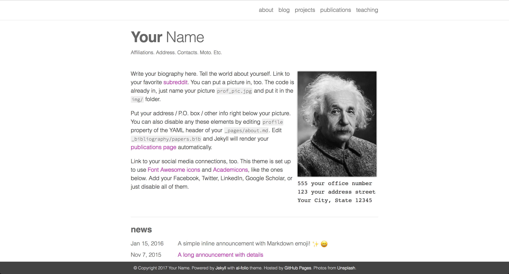

# al-folio

A simple and clean [Jekyll](https://jekyllrb.com/) theme for academics.

Originally, **al-folio** was based on the [\*folio theme](https://github.com/bogoli/-folio) (published by [Lia Bogoev](http://liabogoev.com) and under the MIT license).
Since then, it got a full re-write of the styles and many additional cool features.
The emphasis is on whitespace, transparency, and academic usage: [theme demo](https://alshedivat.github.io/al-folio/).

## License

The theme is available as open source under the terms of the [MIT License](https://opensource.org/licenses/MIT).
